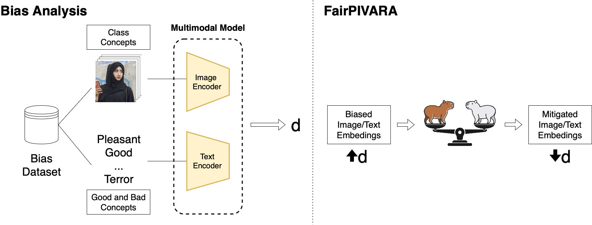

#  FairPIVARA: Reducing and Assessing Biases in CLIP-Based Multimodal Models 

[](https://arxiv.org/abs/2409.19474)

In this work, we evaluate four different types of discriminatory practices within visual-language models and introduce  FairPIVARA, a method to reduce them by removing the most affected dimensions of feature embeddings. The application of  FairPIVARA has led to a significant reduction of up to 98\% in observed biases while promoting a more balanced word distribution within the model.

## Pipeline


In our pipeline, we employed the following models:

+ **Encoders Image/Text**
    - English: CLIP 
    - Portuguese: CAPIVARA

## Results

#### Relative bias

<style type="text/css">
.tg  {border-collapse:collapse;border-spacing:0;}
.tg td{border-color:black;border-style:solid;border-width:1px;font-family:Arial, sans-serif;font-size:14px;
  overflow:hidden;padding:10px 5px;word-break:normal;}
.tg th{border-color:black;border-style:solid;border-width:1px;font-family:Arial, sans-serif;font-size:14px;
  font-weight:normal;overflow:hidden;padding:10px 5px;word-break:normal;}
.tg .tg-oj9v{background-color:#FFFFF6;border-color:inherit;text-align:center;vertical-align:top}
.tg .tg-kwmo{background-color:#FFFFC0;border-color:inherit;text-align:center;vertical-align:top}
.tg .tg-cdo4{background-color:#FFFF2C;border-color:inherit;text-align:center;vertical-align:top}
.tg .tg-ex0g{background-color:#FFFFFC;border-color:inherit;text-align:center;vertical-align:top}
.tg .tg-ip6i{background-color:#FF0;border-color:inherit;font-weight:bold;text-align:center;vertical-align:top}
.tg .tg-i5vq{background-color:#FFFFCF;border-color:inherit;text-align:center;vertical-align:top}
.tg .tg-8mz5{background-color:#FFFCF7;border-color:inherit;text-align:center;vertical-align:top}
.tg .tg-ihdw{background-color:#FFD99E;border-color:inherit;text-align:center;vertical-align:top}
.tg .tg-dfkg{background-color:#FF5;border-color:inherit;text-align:center;vertical-align:top}
.tg .tg-v5cu{background-color:#FFFF83;border-color:inherit;text-align:center;vertical-align:top}
.tg .tg-ye84{background-color:#FFFF56;border-color:inherit;text-align:center;vertical-align:top}
.tg .tg-m9mt{background-color:#FFFF35;border-color:inherit;text-align:center;vertical-align:top}
.tg .tg-8ilv{background-color:#FFFF2B;border-color:inherit;text-align:center;vertical-align:top}
.tg .tg-c3ow{border-color:inherit;text-align:center;vertical-align:top}
.tg .tg-bg49{background-color:#FFD18A;border-color:inherit;text-align:center;vertical-align:top}
.tg .tg-7483{background-color:#FF6D01;border-color:inherit;font-weight:bold;text-align:center;vertical-align:top}
.tg .tg-fx94{background-color:#FFFFB7;border-color:inherit;text-align:center;vertical-align:top}
.tg .tg-cnde{background-color:#FFFF3B;border-color:inherit;text-align:center;vertical-align:top}
.tg .tg-ywcg{background-color:#FFFF30;border-color:inherit;text-align:center;vertical-align:top}
.tg .tg-e9t1{background-color:#FFFF24;border-color:inherit;text-align:center;vertical-align:top}
.tg .tg-nbj5{background-color:#FFF;border-color:inherit;text-align:center;vertical-align:top}
.tg .tg-s0pp{background-color:#FFB749;border-color:inherit;text-align:center;vertical-align:top}
.tg .tg-sz2m{background-color:#FFFBF5;border-color:inherit;text-align:center;vertical-align:top}
.tg .tg-isch{background-color:#FFFF97;border-color:inherit;text-align:center;vertical-align:top}
.tg .tg-6nr6{background-color:#FFFF76;border-color:inherit;text-align:center;vertical-align:top}
.tg .tg-w6ly{background-color:#FFFFE8;border-color:inherit;text-align:center;vertical-align:top}
.tg .tg-w5li{background-color:#FFFF3F;border-color:inherit;text-align:center;vertical-align:top}
.tg .tg-4njm{background-color:#FFFF2A;border-color:inherit;text-align:center;vertical-align:top}
.tg .tg-0pky{border-color:inherit;text-align:left;vertical-align:top}
.tg .tg-7btt{border-color:inherit;font-weight:bold;text-align:center;vertical-align:top}
.tg .tg-dcv2{background-color:#FFFFFE;border-color:inherit;text-align:center;vertical-align:top}
.tg .tg-5pnh{background-color:#FFAD30;border-color:inherit;text-align:center;vertical-align:top}
.tg .tg-h7xb{background-color:#FFFFFD;border-color:inherit;text-align:center;vertical-align:top}
.tg .tg-4tww{background-color:#FFC671;border-color:inherit;text-align:center;vertical-align:top}
.tg .tg-p5pc{background-color:#FFFEFD;border-color:inherit;text-align:center;vertical-align:top}
.tg .tg-eub2{background-color:#FF7;border-color:inherit;text-align:center;vertical-align:top}
.tg .tg-rzs9{background-color:#FFFFB6;border-color:inherit;text-align:center;vertical-align:top}
.tg .tg-993z{background-color:#FFFF64;border-color:inherit;text-align:center;vertical-align:top}
.tg .tg-j84v{background-color:#FFFFB0;border-color:inherit;text-align:center;vertical-align:top}
.tg .tg-kht1{background-color:#FFFF80;border-color:inherit;text-align:center;vertical-align:top}
.tg .tg-dmak{background-color:#FFFF89;border-color:inherit;text-align:center;vertical-align:top}
.tg .tg-q1fx{background-color:#FFE4BC;border-color:inherit;text-align:center;vertical-align:top}
.tg .tg-kli8{background-color:#FFE;border-color:inherit;text-align:center;vertical-align:top}
.tg .tg-uyy9{background-color:#FFFFF2;border-color:inherit;text-align:center;vertical-align:top}
.tg .tg-dm23{background-color:#FFEAC9;border-color:inherit;text-align:center;vertical-align:top}
.tg .tg-5qt7{background-color:#FFFFAC;border-color:inherit;text-align:center;vertical-align:top}
.tg .tg-nv0q{background-color:#FFFFC6;border-color:inherit;text-align:center;vertical-align:top}
.tg .tg-gwea{background-color:#FFD79A;border-color:inherit;text-align:center;vertical-align:top}
.tg .tg-pge5{background-color:#FFD89E;border-color:inherit;text-align:center;vertical-align:top}
.tg .tg-bp4c{background-color:#FFFDF9;border-color:inherit;text-align:center;vertical-align:top}
.tg .tg-tdj2{background-color:#FFFF32;border-color:inherit;text-align:center;vertical-align:top}
.tg .tg-v9nz{background-color:#FFFF3A;border-color:inherit;text-align:center;vertical-align:top}
.tg .tg-brfv{background-color:#FFFF3E;border-color:inherit;text-align:center;vertical-align:top}
.tg .tg-jhu5{background-color:#FFFFA1;border-color:inherit;text-align:center;vertical-align:top}
.tg .tg-43qc{background-color:#FFA;border-color:inherit;text-align:center;vertical-align:top}
.tg .tg-a508{background-color:#FFFF27;border-color:inherit;text-align:center;vertical-align:top}
.tg .tg-tn8c{background-color:#FFFF23;border-color:inherit;text-align:center;vertical-align:top}
.tg .tg-fmi4{background-color:#FFFF3D;border-color:inherit;text-align:center;vertical-align:top}
.tg .tg-lvtm{background-color:#FFFF69;border-color:inherit;text-align:center;vertical-align:top}
</style>
<table class="tg"><thead>
  <tr>
    <th class="tg-0pky"></th>
    <th class="tg-7483"><span style="font-weight:bold;background-color:#FF6D01">Target X</span></th>
    <th class="tg-ip6i"><span style="font-weight:bold;background-color:#FF0">Target Y</span></th>
    <th class="tg-0pky"></th>
    <th class="tg-7btt"><span style="font-weight:bold">CLIP Base</span></th>
    <th class="tg-7btt"><span style="font-weight:bold">MMBias</span></th>
    <th class="tg-7btt"><span style="font-weight:bold">Reduction (%)</span></th>
    <th class="tg-7btt"><span style="font-weight:bold">FairPIVARA</span></th>
    <th class="tg-7btt"><span style="font-weight:bold">Reduction (%)</span></th>
    <th class="tg-0pky"></th>
    <th class="tg-7btt"><span style="font-weight:bold">CAPIVARA</span></th>
    <th class="tg-7btt"><span style="font-weight:bold">FairPIVARA</span></th>
    <th class="tg-7btt"><span style="font-weight:bold">Reduction (%)</span></th>
  </tr></thead>
<tbody>
  <tr>
    <td class="tg-c3ow" rowspan="3">Disability</td>
    <td class="tg-c3ow">Mental Disability</td>
    <td class="tg-c3ow">Non-Disabled</td>
    <td class="tg-0pky"></td>
    <td class="tg-s0pp"><span style="background-color:#FFB749">1,43</span></td>
    <td class="tg-s0pp"><span style="background-color:#FFB749">1,43</span></td>
    <td class="tg-c3ow">0,00%</td>
    <td class="tg-dcv2"><span style="background-color:#FFFFFE">0,01</span></td>
    <td class="tg-c3ow">99,30%</td>
    <td class="tg-0pky"></td>
    <td class="tg-5pnh"><span style="background-color:#FFAD30">1,63</span></td>
    <td class="tg-h7xb"><span style="background-color:#FFFFFD">-0,01</span></td>
    <td class="tg-c3ow">99,39%</td>
  </tr>
  <tr>
    <td class="tg-c3ow">Mental Disability</td>
    <td class="tg-c3ow">Physical Disability</td>
    <td class="tg-0pky"></td>
    <td class="tg-bg49"><span style="background-color:#FFD18A">0,92</span></td>
    <td class="tg-bg49"><span style="background-color:#FFD18A">0,92</span></td>
    <td class="tg-c3ow">0,00%</td>
    <td class="tg-dcv2"><span style="background-color:#FFFFFE">0,01</span></td>
    <td class="tg-c3ow">98,91%</td>
    <td class="tg-0pky"></td>
    <td class="tg-4tww"><span style="background-color:#FFC671">1,12</span></td>
    <td class="tg-p5pc"><span style="background-color:#FFFEFD">0,02</span></td>
    <td class="tg-c3ow">98,21%</td>
  </tr>
  <tr>
    <td class="tg-c3ow">Non-Disabled</td>
    <td class="tg-c3ow">Physical Disability</td>
    <td class="tg-0pky"></td>
    <td class="tg-eub2"><span style="background-color:#FF7">-1,06</span></td>
    <td class="tg-rzs9"><span style="background-color:#FFFFB6">-0,57</span></td>
    <td class="tg-c3ow">46,23%</td>
    <td class="tg-p5pc"><span style="background-color:#FFFEFD">0,02</span></td>
    <td class="tg-c3ow">98,11%</td>
    <td class="tg-0pky"></td>
    <td class="tg-ye84"><span style="background-color:#FFFF56">-1,32</span></td>
    <td class="tg-nbj5"><span style="background-color:#FFF">0,00</span></td>
    <td class="tg-c3ow">100,00%</td>
  </tr>
  <tr>
    <td class="tg-c3ow" rowspan="6">Nationality</td>
    <td class="tg-c3ow">American</td>
    <td class="tg-c3ow">Arab</td>
    <td class="tg-0pky"></td>
    <td class="tg-v5cu"><span style="background-color:#FFFF83">-0,97</span></td>
    <td class="tg-isch"><span style="background-color:#FFFF97">-0,81</span></td>
    <td class="tg-c3ow">16,49%</td>
    <td class="tg-dcv2"><span style="background-color:#FFFFFE">0,01</span></td>
    <td class="tg-c3ow">98,97%</td>
    <td class="tg-0pky"></td>
    <td class="tg-993z"><span style="background-color:#FFFF64">-1,21</span></td>
    <td class="tg-nbj5"><span style="background-color:#FFF">0,00</span></td>
    <td class="tg-c3ow">100,00%</td>
  </tr>
  <tr>
    <td class="tg-c3ow">American</td>
    <td class="tg-c3ow">Chinese</td>
    <td class="tg-0pky"></td>
    <td class="tg-fx94"><span style="background-color:#FFFFB7">-0,56</span></td>
    <td class="tg-kwmo"><span style="background-color:#FFFFC0">-0,49</span></td>
    <td class="tg-c3ow">12,50%</td>
    <td class="tg-p5pc"><span style="background-color:#FFFEFD">0,02</span></td>
    <td class="tg-c3ow">96,43%</td>
    <td class="tg-0pky"></td>
    <td class="tg-j84v"><span style="background-color:#FFFFB0">-0,62</span></td>
    <td class="tg-nbj5"><span style="background-color:#FFF">0,00</span></td>
    <td class="tg-c3ow">100,00%</td>
  </tr>
  <tr>
    <td class="tg-c3ow">American</td>
    <td class="tg-c3ow">Mexican</td>
    <td class="tg-0pky"></td>
    <td class="tg-6nr6"><span style="background-color:#FFFF76">-1,07</span></td>
    <td class="tg-kht1"><span style="background-color:#FFFF80">-0,99</span></td>
    <td class="tg-c3ow">7,48%</td>
    <td class="tg-nbj5"><span style="background-color:#FFF">0,00</span></td>
    <td class="tg-c3ow">100,00%</td>
    <td class="tg-0pky"></td>
    <td class="tg-dmak"><span style="background-color:#FFFF89">-0,92</span></td>
    <td class="tg-nbj5"><span style="background-color:#FFF">0,00</span></td>
    <td class="tg-c3ow">100,00%</td>
  </tr>
  <tr>
    <td class="tg-c3ow">Arab</td>
    <td class="tg-c3ow">Chinese</td>
    <td class="tg-0pky"></td>
    <td class="tg-q1fx"><span style="background-color:#FFE4BC">0,53</span></td>
    <td class="tg-q1fx"><span style="background-color:#FFE4BC">0,53</span></td>
    <td class="tg-c3ow">0,00%</td>
    <td class="tg-nbj5"><span style="background-color:#FFF">0,00</span></td>
    <td class="tg-c3ow">100,00%</td>
    <td class="tg-0pky"></td>
    <td class="tg-ihdw"><span style="background-color:#FFD99E">0,76</span></td>
    <td class="tg-nbj5"><span style="background-color:#FFF">0,00</span></td>
    <td class="tg-c3ow">100,00%</td>
  </tr>
  <tr>
    <td class="tg-c3ow">Arab</td>
    <td class="tg-c3ow">Mexican</td>
    <td class="tg-0pky"></td>
    <td class="tg-kli8"><span style="background-color:#FFE">-0,13</span></td>
    <td class="tg-uyy9"><span style="background-color:#FFFFF2">-0,10</span></td>
    <td class="tg-c3ow">23,08%</td>
    <td class="tg-ex0g"><span style="background-color:#FFFFFC">-0,02</span></td>
    <td class="tg-c3ow">84,62%</td>
    <td class="tg-0pky"></td>
    <td class="tg-dm23"><span style="background-color:#FFEAC9">0,43</span></td>
    <td class="tg-ex0g"><span style="background-color:#FFFFFC">-0,02</span></td>
    <td class="tg-c3ow">95,33%</td>
  </tr>
  <tr>
    <td class="tg-c3ow">Chinese</td>
    <td class="tg-c3ow">Mexican</td>
    <td class="tg-0pky"></td>
    <td class="tg-5qt7"><span style="background-color:#FFFFAC">-0,65</span></td>
    <td class="tg-nv0q"><span style="background-color:#FFFFC6">-0,44</span></td>
    <td class="tg-c3ow">32,31%</td>
    <td class="tg-nbj5"><span style="background-color:#FFF">0,00</span></td>
    <td class="tg-c3ow">100,00%</td>
    <td class="tg-0pky"></td>
    <td class="tg-i5vq"><span style="background-color:#FFFFCF">-0,37</span></td>
    <td class="tg-h7xb"><span style="background-color:#FFFFFD">-0,01</span></td>
    <td class="tg-c3ow">97,32%</td>
  </tr>
  <tr>
    <td class="tg-c3ow" rowspan="10">Religion</td>
    <td class="tg-c3ow">Buddhist</td>
    <td class="tg-c3ow">Christian</td>
    <td class="tg-0pky"></td>
    <td class="tg-gwea"><span style="background-color:#FFD79A">0,80</span></td>
    <td class="tg-gwea"><span style="background-color:#FFD79A">0,80</span></td>
    <td class="tg-c3ow">0,00%</td>
    <td class="tg-h7xb"><span style="background-color:#FFFFFD">-0,01</span></td>
    <td class="tg-c3ow">98,75%</td>
    <td class="tg-0pky"></td>
    <td class="tg-pge5"><span style="background-color:#FFD89E">0,77</span></td>
    <td class="tg-nbj5"><span style="background-color:#FFF">0,00</span></td>
    <td class="tg-c3ow">100,00%</td>
  </tr>
  <tr>
    <td class="tg-c3ow">Buddhist</td>
    <td class="tg-c3ow">Hindu</td>
    <td class="tg-0pky"></td>
    <td class="tg-nbj5"><span style="background-color:#FFF">0,00</span></td>
    <td class="tg-nbj5"><span style="background-color:#FFF">0,00</span></td>
    <td class="tg-c3ow">0,00%</td>
    <td class="tg-bp4c"><span style="background-color:#FFFDF9">0,05</span></td>
    <td class="tg-c3ow">0,00%</td>
    <td class="tg-0pky"></td>
    <td class="tg-sz2m"><span style="background-color:#FFFBF5">0,08</span></td>
    <td class="tg-dcv2"><span style="background-color:#FFFFFE">0,01</span></td>
    <td class="tg-c3ow">87,68%</td>
  </tr>
  <tr>
    <td class="tg-c3ow">Buddhist</td>
    <td class="tg-c3ow">Jewish</td>
    <td class="tg-0pky"></td>
    <td class="tg-8ilv"><span style="background-color:#FFFF2B">-1,66</span></td>
    <td class="tg-8ilv"><span style="background-color:#FFFF2B">-1,66</span></td>
    <td class="tg-c3ow">0,00%</td>
    <td class="tg-dcv2"><span style="background-color:#FFFFFE">0,01</span></td>
    <td class="tg-c3ow">99,40%</td>
    <td class="tg-0pky"></td>
    <td class="tg-ywcg"><span style="background-color:#FFFF30">-1,62</span></td>
    <td class="tg-nbj5"><span style="background-color:#FFF">0,00</span></td>
    <td class="tg-c3ow">100,00%</td>
  </tr>
  <tr>
    <td class="tg-c3ow">Buddhist</td>
    <td class="tg-c3ow">Muslim</td>
    <td class="tg-0pky"></td>
    <td class="tg-tdj2"><span style="background-color:#FFFF32">-1,60</span></td>
    <td class="tg-v9nz"><span style="background-color:#FFFF3A">-1,54</span></td>
    <td class="tg-c3ow">3,75%</td>
    <td class="tg-dcv2"><span style="background-color:#FFFFFE">0,01</span></td>
    <td class="tg-c3ow">99,38%</td>
    <td class="tg-0pky"></td>
    <td class="tg-brfv"><span style="background-color:#FFFF3E">-1,51</span></td>
    <td class="tg-dcv2"><span style="background-color:#FFFFFE">0,01</span></td>
    <td class="tg-c3ow">99,34%</td>
  </tr>
  <tr>
    <td class="tg-c3ow">Christian</td>
    <td class="tg-c3ow">Hindu</td>
    <td class="tg-0pky"></td>
    <td class="tg-jhu5"><span style="background-color:#FFFFA1">-0,73</span></td>
    <td class="tg-5qt7"><span style="background-color:#FFFFAC">-0,65</span></td>
    <td class="tg-c3ow">10,96%</td>
    <td class="tg-ex0g"><span style="background-color:#FFFFFC">-0,02</span></td>
    <td class="tg-c3ow">97,26%</td>
    <td class="tg-0pky"></td>
    <td class="tg-43qc"><span style="background-color:#FFA">-0,67</span></td>
    <td class="tg-nbj5"><span style="background-color:#FFF">0,00</span></td>
    <td class="tg-c3ow">100,00%</td>
  </tr>
  <tr>
    <td class="tg-c3ow">Christian</td>
    <td class="tg-c3ow">Jewish</td>
    <td class="tg-0pky"></td>
    <td class="tg-e9t1"><span style="background-color:#FFFF24">-1,71</span></td>
    <td class="tg-a508"><span style="background-color:#FFFF27">-1,69</span></td>
    <td class="tg-c3ow">1,17%</td>
    <td class="tg-nbj5"><span style="background-color:#FFF">0,00</span></td>
    <td class="tg-c3ow">100,00%</td>
    <td class="tg-0pky"></td>
    <td class="tg-tn8c"><span style="background-color:#FFFF23">-1,72</span></td>
    <td class="tg-h7xb"><span style="background-color:#FFFFFD">-0,01</span></td>
    <td class="tg-c3ow">99,42%</td>
  </tr>
  <tr>
    <td class="tg-c3ow">Christian</td>
    <td class="tg-c3ow">Muslim</td>
    <td class="tg-0pky"></td>
    <td class="tg-4njm"><span style="background-color:#FFFF2A">-1,67</span></td>
    <td class="tg-cdo4"><span style="background-color:#FFFF2C">-1,65</span></td>
    <td class="tg-c3ow">1,20%</td>
    <td class="tg-dcv2"><span style="background-color:#FFFFFE">0,01</span></td>
    <td class="tg-c3ow">99,40%</td>
    <td class="tg-0pky"></td>
    <td class="tg-cdo4"><span style="background-color:#FFFF2C">-1,65</span></td>
    <td class="tg-dcv2"><span style="background-color:#FFFFFE">0,01</span></td>
    <td class="tg-c3ow">99,39%</td>
  </tr>
  <tr>
    <td class="tg-c3ow">Hindu</td>
    <td class="tg-c3ow">Jewish</td>
    <td class="tg-0pky"></td>
    <td class="tg-m9mt"><span style="background-color:#FFFF35">-1,58</span></td>
    <td class="tg-m9mt"><span style="background-color:#FFFF35">-1,58</span></td>
    <td class="tg-c3ow">0,00%</td>
    <td class="tg-h7xb"><span style="background-color:#FFFFFD">-0,01</span></td>
    <td class="tg-c3ow">99,37%</td>
    <td class="tg-0pky"></td>
    <td class="tg-tdj2"><span style="background-color:#FFFF32">-1,60</span></td>
    <td class="tg-p5pc"><span style="background-color:#FFFEFD">0,02</span></td>
    <td class="tg-c3ow">98,75%</td>
  </tr>
  <tr>
    <td class="tg-c3ow">Hindu</td>
    <td class="tg-c3ow">Muslim</td>
    <td class="tg-0pky"></td>
    <td class="tg-cnde"><span style="background-color:#FFFF3B">-1,53</span></td>
    <td class="tg-fmi4"><span style="background-color:#FFFF3D">-1,52</span></td>
    <td class="tg-c3ow">0,65%</td>
    <td class="tg-p5pc"><span style="background-color:#FFFEFD">0,02</span></td>
    <td class="tg-c3ow">98,69%</td>
    <td class="tg-0pky"></td>
    <td class="tg-w5li"><span style="background-color:#FFFF3F">-1,50</span></td>
    <td class="tg-dcv2"><span style="background-color:#FFFFFE">0,01</span></td>
    <td class="tg-c3ow">99,33%</td>
  </tr>
  <tr>
    <td class="tg-c3ow">Jewish</td>
    <td class="tg-c3ow">Muslim</td>
    <td class="tg-0pky"></td>
    <td class="tg-w6ly"><span style="background-color:#FFFFE8">-0,18</span></td>
    <td class="tg-oj9v"><span style="background-color:#FFFFF6">-0,07</span></td>
    <td class="tg-c3ow">61,11%</td>
    <td class="tg-p5pc"><span style="background-color:#FFFEFD">0,02</span></td>
    <td class="tg-c3ow">88,89%</td>
    <td class="tg-0pky"></td>
    <td class="tg-8mz5"><span style="background-color:#FFFCF7">0,07</span></td>
    <td class="tg-dcv2"><span style="background-color:#FFFFFE">0,01</span></td>
    <td class="tg-c3ow">85,24%</td>
  </tr>
  <tr>
    <td class="tg-nbj5"><span style="background-color:#FFF">Sexua Orientation</span></td>
    <td class="tg-c3ow">Heterosexual</td>
    <td class="tg-c3ow">LGBT</td>
    <td class="tg-0pky"></td>
    <td class="tg-dfkg"><span style="background-color:#FF5">-1,33</span></td>
    <td class="tg-ye84"><span style="background-color:#FFFF56">-1,32</span></td>
    <td class="tg-c3ow">0,75%</td>
    <td class="tg-p5pc"><span style="background-color:#FFFEFD">0,02</span></td>
    <td class="tg-c3ow">98,50%</td>
    <td class="tg-0pky"></td>
    <td class="tg-lvtm"><span style="background-color:#FFFF69">-1,18</span></td>
    <td class="tg-p5pc"><span style="background-color:#FFFEFD">0,02</span></td>
    <td class="tg-c3ow">98,30%</td>
  </tr>
</tbody></table>

Relative bias between classes for OpenCLIP and CAPIVARA models, along with bias reduction by MMBias and FairPIVARA algorithms. Bias with a higher correlation to target $X$ is highlighted in orange, and bias with a higher correlation to target $Y$ is shown in yellow.

#### Classification Performance

|   Model  | Metric |    ImageNet   |                 |   CIFAR-100   |                 |    ELEVATER   |                 |
|:--------:|:------:|:-------------:|:---------------:|:-------------:|:---------------:|:-------------:|:---------------:|
|          |        | Original (\%) | FairPIVARA (\%) | Original (\%) | FairPIVARA (\%) | Original (\%) | FairPIVARA (\%) |
| OpenCLIP |  Top-1 |      61.8     |       61.3      |      77.0     |       76.2      |      61.6     |       60.8      |
|          |  Top-5 |      87.6     |       87.3      |      94.4     |       93.4      |               |                 |
| CAPIVARA |  Top-1 |      46.1     |       44.9      |      69.4     |       67.6      |      57.5     |       56.5      |
|          |  Top-5 |      70.6     |       69.5      |      90.2     |       89.4      |               |                 |

Performance comparison between OpenCLIP and CAPIVARA models, both without (Original) and with bias mitigation (FairPIVARA), on ImageNet, CIFAR-100, and the ELEVATER benchmark. OpenCLIP is evaluated in English, and CAPIVARA in Portuguese.


## Reproducibility
<!-- ### Installation
Run the following command to install required packages.

```bash
pip install -r requirements.txt
``` -->

### Code organization

```
├─ README.md
├─ assets
│  ├─ FairPIVARA_Diagram.png
│  ├─ fairpivara.png
FairPIVARA
│  ├─ utils					
│  │  └─ highest_frequency_dimensions.py <--- auxiliary methods for checking the highest frequency dimensions
│  ├─ visualizers <--- .ipynb files for viewing results.				
│  │  └─ classificationTables.ipynb <--- creating and viewing classification tables
│  │  └─ en-visualizer.ipynb <--- graphs for results analysis in English
│  │  └─ pt-br-visualizer.ipynb <--- graphs for results analysis in Portuguese
│  │  └─ ZeroShotClassification.ipynb <--- zero-shot grading with visualization.
│  │  └─ ZeroShotRetrieval.ipynb <--- zero-shot retrieval with visualization.
│  └─ src
│     ├─ individual_bias_run <--- sh to run classification.py
│     ├─ individual_bias.py <--- calculates the results of individual bias, to create comparative tables of bias by concepts.
│     ├─ FairPIVARA.py <--- performs the check of which dimensions should be removed (module calculate_bias_separately) or calculates the results for Relative Bias (module bias_calculation)
```

### Three main functions are implemented for the use of FairPIVARA
+ FairPIVARA Algorithm: For selecting which dimensions can be optimally removed from the embedding.
+ Individual Bias: Calculation of Bias individually and comparatively between concepts (Tables 1, 2 and 3).
+ Relative Bias: Calculation of Bias in a relative way, between two classes, Table 4.

#### FairPIVARA Algorithm

The FairPIVARA.py file must be used, with the calculate_bias_separately module.
The following arguments are supported:

```python
GPU = 2 
MAIN_PATH = '/hadatasets/MMBias'
DATASET_PATH = '/hadatasets/MMBias/data'
rude_level = 1 # Political (1) or non-political bias dataset
LANGUAGE_PATH = 'data'
LANGUAGE = 'en' # 'en', 'pt-br'
ft_open_clip = 'False'
adapter = 'False'
CONCEPTS='Disability/Mental|Disability,Disability/Non-Disabled,Disability/Physical|Disability,Nationality/American,Nationality/Arab,Nationality/Chinese,Nationality/Mexican,Religion/Buddhist,Religion/Christian,Religion/Hindu,Religion/Jewish,Religion/Muslim,Sexual|Orientation/Heterosexual,Sexual|Orientation/LGBT' # Concepts used in classification  (| for space and , for and)
weighted_list='False'
add_signal = 'True'
sorted_df_similarities = 'True'
top_similar = 15 # '', '15' Number of terms considered
embedding_dimension=512 # Number of model embedding dimensions
module = 'bias_calculation' #'calculate_bias_separately','bias_calculation' 
theta = [0.05] # Theta value : [0.01, 0.02, 0.03, 0.04, 0.05]
N_size = [54] # Number of dimensions to be removed : [27, 54, 81, 108, 135, 162, 189, 216, 243, 270, 297, 324, 351, 378, 405, 432, 459, 486, 512]
function_to_optimize = 'minimize' # minimize, maximize
```

#### Relative Bias

Using the bias_calculation module of the FairPIVARA.py file, it is possible to calculate the results for Relative Bias.
The following additional arguments will be required:

```python
# Parameters used for the bias calculation module
repeat_times = [1000] # number of times the algorithm is repeated : [1, 100, 1000]
file_read = 'multiple_sets' # File reading type 'multiple_sets, same_set'
bias_type = 'same_as_X' # Type of remotions for text. random, random_A_B, same_as_X, none
file_with_dimensions = ['']  # File with the dimensions to be removed #'results/theta-001to005/results_theta_0-05.txt'
```

In addition to changing module to:

```python
module = 'bias_calculation' 
```

#### Individual Bias

The individual_bias.py file calculates biases individually for each concept and its bias relationship with its labels.
To run this file, a support sh can be used (individual_bias_run.sh).
The following arguments are supported:

```python
FT_OPEN_CLIP='False' #Used in pt fine-tuning
GPU=2 
DATASET_PATH="/hadatasets/MMBias/data"
RUDE_LEVEL=1 # Political (1) or non-political bias dataset
CONCEPTS='Disability/Mental|Disability,Disability/Non-Disabled,Disability/Physical|Disability,Nationality/American,Nationality/Arab,Nationality/Chinese,Nationality/Mexican,Religion/Buddhist,Religion/Christian,Religion/Hindu,Religion/Jewish,Religion/Muslim,Sexual|Orientation/Heterosexual,Sexual|Orientation/LGBT' # Concepts used in classification  (| for space and , for and)
LANGUAGE='en' # "en", "pt-br"
TASK='classification'
PRINT='exel' #'json' , 'exel', 'pandas'  #pandas used to violin plots
SCORE_OR_QUANT=both #'both_operation (with mean), both'
WEIGHTED_LIST='False'
EXTRACT_TOP_SIMILAR='15'  # '', '15' Number of terms considered
VIEW_TOP_SIMILAR='15'  #N umber of terms considered in view. For exel, we used '15'. For the violin, it is necessary to have value ''. 
TOP_TYPE='top' # 'top', 'equal' # The firsts ones or per type # equal don't work with pandas print
REMOVE_DIMENSIONS_LIST='' # Listo of dimensions to be removed : '' , 'results/theta-001to005/results_theta_same_values.txt'
REPETITIONS=1000 # number of times the algorithm is repeated 
BIAS_TYPE='same_as_selected' # Type of remotions for text. 'same_as_selected','random_text','random' Used with remove-dimensions-list, if remove-dimensions-list is empty, this parameter is ignored

```

## Acknowledgements

This project was supported by the Ministry of Science, Technology, and Innovation of Brazil, with resources granted by the Federal Law 8.248 of October 23, 1991, under the PPI-Softex. The project was coordinated by Softex and published as Intelligent agents for mobile platforms based on Cognitive Architecture technology 01245.003479/2024-10. D.A.B.M. is partially funded by FAPESP 2023/05939-5. A.I.F. and N.S. are partially funded by Centro de Excelência em Inteligência Artificial, da Universidade Federal de Goiás. G.O.S is partially funded by FAPESP 2024/07969-1. H.P. is partially funded by CNPq 304836/2022-2. S.A. is partially funded by CNPq 316489/2023-9, FAPESP 2013/08293-7, 2020/09838-0, 2023/12086-9, and Google Award for Inclusion Research 2022.

## Citation
```bibtex
@misc{moreira2024fairpivarareducingassessingbiases,
      title={FairPIVARA: Reducing and Assessing Biases in CLIP-Based Multimodal Models}, 
      author={Diego A. B. Moreira and Alef Iury Ferreira and Gabriel Oliveira dos Santos and Luiz Pereira and João Medrado Gondim and Gustavo Bonil and Helena Maia and Nádia da Silva and Simone Tiemi Hashiguti and Jefersson A. dos Santos and Helio Pedrini and Sandra Avila},
      year={2024},
      eprint={2409.19474},
      archivePrefix={arXiv},
      primaryClass={cs.CV},
      url={https://arxiv.org/abs/2409.19474}, 
}
```
