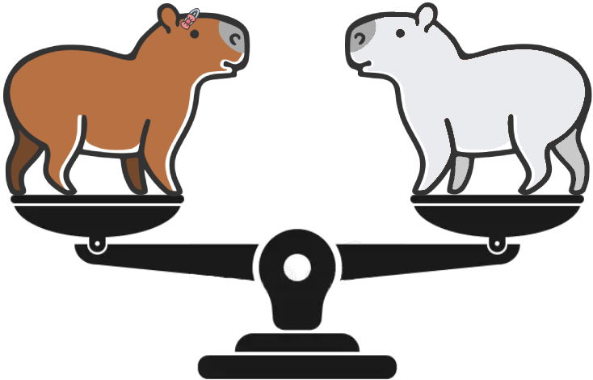

#  FairPIVARA: Reducing and Assessing Biases in CLIP-Based Multimodal Models 

In this work, we evaluate four different types of discriminatory practices within visual-language models and introduce  FairPIVARA, a method to reduce them by removing the most affected dimensions of feature embeddings. The application of  FairPIVARA has led to a significant reduction of up to 98\% in observed biases while promoting a more balanced word distribution within the model.

## Pipeline


In our pipeline, we employed the following models:

+ **Encoders Image/Text**
    - English: CLIP 
    - Portuguese: CAPIVARA

## Results

#### Relative bias

|                   |                   |                     |   |    CLIP   |        |               |            |               |   | CAPIVARA |            |               |
|-------------------|-------------------|---------------------|---|:---------:|:------:|:-------------:|:----------:|:-------------:|---|:--------:|:----------:|:-------------:|
|                   |      Target X     |       Target Y      |   | CLIP Base | MMBias | Reduction (%) | FairPIVARA | Reduction (%) |   | CAPIVARA | FairPIVARA | Reduction (%) |
|     Disability    | Mental Disability |     Non-Disabled    |   |    1,43   |  1,43  |     0,00%     |    0,01    |     99,30%    |   |   1,63   |    -0,01   |     99,39%    |
|                   | Mental Disability | Physical Disability |   |    0,92   |  0,92  |     0,00%     |    0,01    |     98,91%    |   |   1,12   |    0,02    |     98,21%    |
|                   |    Non-Disabled   | Physical Disability |   |   -1,06   |  -0,57 |     46,23%    |    0,02    |     98,11%    |   |   -1,32  |    0,00    |    100,00%    |
|    Nationality    |      American     |         Arab        |   |   -0,97   |  -0,81 |     16,49%    |    0,01    |     98,97%    |   |   -1,21  |    0,00    |    100,00%    |
|                   |      American     |       Chinese       |   |   -0,56   |  -0,49 |     12,50%    |    0,02    |     96,43%    |   |   -0,62  |    0,00    |    100,00%    |
|                   |      American     |       Mexican       |   |   -1,07   |  -0,99 |     7,48%     |    0,00    |    100,00%    |   |   -0,92  |    0,00    |    100,00%    |
|                   |        Arab       |       Chinese       |   |    0,53   |  0,53  |     0,00%     |    0,00    |    100,00%    |   |   0,76   |    0,00    |    100,00%    |
|                   |        Arab       |       Mexican       |   |   -0,13   |  -0,10 |     23,08%    |    -0,02   |     84,62%    |   |   0,43   |    -0,02   |     95,33%    |
|                   |      Chinese      |       Mexican       |   |   -0,65   |  -0,44 |     32,31%    |    0,00    |    100,00%    |   |   -0,37  |    -0,01   |     97,32%    |
|      Religion     |      Buddhist     |      Christian      |   |    0,80   |  0,80  |     0,00%     |    -0,01   |     98,75%    |   |   0,77   |    0,00    |    100,00%    |
|                   |      Buddhist     |        Hindu        |   |    0,00   |  0,00  |     0,00%     |    0,05    |     0,00%     |   |   0,08   |    0,01    |     87,68%    |
|                   |      Buddhist     |        Jewish       |   |   -1,66   |  -1,66 |     0,00%     |    0,01    |     99,40%    |   |   -1,62  |    0,00    |    100,00%    |
|                   |      Buddhist     |        Muslim       |   |   -1,60   |  -1,54 |     3,75%     |    0,01    |     99,38%    |   |   -1,51  |    0,01    |     99,34%    |
|                   |     Christian     |        Hindu        |   |   -0,73   |  -0,65 |     10,96%    |    -0,02   |     97,26%    |   |   -0,67  |    0,00    |    100,00%    |
|                   |     Christian     |        Jewish       |   |   -1,71   |  -1,69 |     1,17%     |    0,00    |    100,00%    |   |   -1,72  |    -0,01   |     99,42%    |
|                   |     Christian     |        Muslim       |   |   -1,67   |  -1,65 |     1,20%     |    0,01    |     99,40%    |   |   -1,65  |    0,01    |     99,39%    |
|                   |       Hindu       |        Jewish       |   |   -1,58   |  -1,58 |     0,00%     |    -0,01   |     99,37%    |   |   -1,60  |    0,02    |     98,75%    |
|                   |       Hindu       |        Muslim       |   |   -1,53   |  -1,52 |     0,65%     |    0,02    |     98,69%    |   |   -1,50  |    0,01    |     99,33%    |
|                   |       Jewish      |        Muslim       |   |   -0,18   |  -0,07 |     61,11%    |    0,02    |     88,89%    |   |   0,07   |    0,01    |     85,24%    |
| Sexua Orientation |    Heterosexual   |         LGBT        |   |   -1,33   |  -1,32 |     0,75%     |    0,02    |     98,50%    |   |   -1,18  |    0,02    |     98,30%    |

Relative bias between classes for OpenCLIP and CAPIVARA models, along with bias reduction by MMBias and FairPIVARA algorithms. Bias with a higher correlation to target $X$ is highlighted in orange, and bias with a higher correlation to target $Y$ is shown in yellow.

#### Classification Performance

|   Model  | Metric |    ImageNet   |                 |   CIFAR-100   |                 |    ELEVATER   |                 |
|:--------:|:------:|:-------------:|:---------------:|:-------------:|:---------------:|:-------------:|:---------------:|
|          |        | Original (\%) | FairPIVARA (\%) | Original (\%) | FairPIVARA (\%) | Original (\%) | FairPIVARA (\%) |
| OpenCLIP |  Top-1 |      61.8     |       61.3      |      77.0     |       76.2      |      61.6     |       60.8      |
|          |  Top-5 |      87.6     |       87.3      |      94.4     |       93.4      |               |                 |
| CAPIVARA |  Top-1 |      46.1     |       44.9      |      69.4     |       67.6      |      57.5     |       56.5      |
|          |  Top-5 |      70.6     |       69.5      |      90.2     |       89.4      |               |                 |

Performance comparison between OpenCLIP and CAPIVARA models, both without (Original) and with bias mitigation (FairPIVARA), on ImageNet, CIFAR-100, and the ELEVATER benchmark. OpenCLIP is evaluated in English, and CAPIVARA in Portuguese.


## Reproducibility
<!-- ### Installation
Run the following command to install required packages.

```bash
pip install -r requirements.txt
``` -->

### Code organization

```
├─ README.md
├─ assets
│  ├─ FairPIVARA_Diagram.png
│  ├─ fairpivara.png
FairPIVARA
│  ├─ utils					
│  │  └─ highest_frequency_dimensions.py <--- auxiliary methods for checking the highest frequency dimensions
│  ├─ visualizers <--- .ipynb files for viewing results.				
│  │  └─ classificationTables.ipynb <--- creating and viewing classification tables
│  │  └─ en-visualizer.ipynb <--- graphs for results analysis in English
│  │  └─ pt-br-visualizer.ipynb <--- graphs for results analysis in Portuguese
│  │  └─ ZeroShotClassification.ipynb <--- zero-shot grading with visualization.
│  │  └─ ZeroShotRetrieval.ipynb <--- zero-shot retrieval with visualization.
│  └─ src
│     ├─ individual_bias_run <--- sh to run classification.py
│     ├─ individual_bias.py <--- calculates the results of individual bias, to create comparative tables of bias by concepts.
│     ├─ FairPIVARA.py <--- performs the check of which dimensions should be removed (module calculate_bias_separately) or calculates the results for Relative Bias (module bias_calculation)
```

### Three main functions are implemented for the use of FairPIVARA
+ FairPIVARA Algorithm: For selecting which dimensions can be optimally removed from the embedding.
+ Individual Bias: Calculation of Bias individually and comparatively between concepts (Tables 1, 2 and 3).
+ Relative Bias: Calculation of Bias in a relative way, between two classes, Table 4.

#### FairPIVARA Algorithm

The FairPIVARA.py file must be used, with the calculate_bias_separately module.
The following arguments are supported:

```python
GPU = 2 
MAIN_PATH = '/hadatasets/MMBias'
DATASET_PATH = '/hadatasets/MMBias/data'
rude_level = 1 # Political (1) or non-political bias dataset
LANGUAGE_PATH = 'data'
LANGUAGE = 'en' # 'en', 'pt-br'
ft_open_clip = 'False'
adapter = 'False'
CONCEPTS='Disability/Mental|Disability,Disability/Non-Disabled,Disability/Physical|Disability,Nationality/American,Nationality/Arab,Nationality/Chinese,Nationality/Mexican,Religion/Buddhist,Religion/Christian,Religion/Hindu,Religion/Jewish,Religion/Muslim,Sexual|Orientation/Heterosexual,Sexual|Orientation/LGBT' # Concepts used in classification  (| for space and , for and)
weighted_list='False'
add_signal = 'True'
sorted_df_similarities = 'True'
top_similar = 15 # '', '15' Number of terms considered
embedding_dimension=512 # Number of model embedding dimensions
module = 'bias_calculation' #'calculate_bias_separately','bias_calculation' 
theta = [0.05] # Theta value : [0.01, 0.02, 0.03, 0.04, 0.05]
N_size = [54] # Number of dimensions to be removed : [27, 54, 81, 108, 135, 162, 189, 216, 243, 270, 297, 324, 351, 378, 405, 432, 459, 486, 512]
function_to_optimize = 'minimize' # minimize, maximize
```

#### Relative Bias

Using the bias_calculation module of the FairPIVARA.py file, it is possible to calculate the results for Relative Bias.
The following additional arguments will be required:

```python
# Parameters used for the bias calculation module
repeat_times = [1000] # number of times the algorithm is repeated : [1, 100, 1000]
file_read = 'multiple_sets' # File reading type 'multiple_sets, same_set'
bias_type = 'same_as_X' # Type of remotions for text. random, random_A_B, same_as_X, none
file_with_dimensions = ['']  # File with the dimensions to be removed #'results/theta-001to005/results_theta_0-05.txt'
```

In addition to changing module to:

```python
module = 'bias_calculation' 
```

#### Individual Bias

The individual_bias.py file calculates biases individually for each concept and its bias relationship with its labels.
To run this file, a support sh can be used (individual_bias_run.sh).
The following arguments are supported:

```python
FT_OPEN_CLIP='False' #Used in pt fine-tuning
GPU=2 
DATASET_PATH="/hadatasets/MMBias/data"
RUDE_LEVEL=1 # Political (1) or non-political bias dataset
CONCEPTS='Disability/Mental|Disability,Disability/Non-Disabled,Disability/Physical|Disability,Nationality/American,Nationality/Arab,Nationality/Chinese,Nationality/Mexican,Religion/Buddhist,Religion/Christian,Religion/Hindu,Religion/Jewish,Religion/Muslim,Sexual|Orientation/Heterosexual,Sexual|Orientation/LGBT' # Concepts used in classification  (| for space and , for and)
LANGUAGE='en' # "en", "pt-br"
TASK='classification'
PRINT='exel' #'json' , 'exel', 'pandas'  #pandas used to violin plots
SCORE_OR_QUANT=both #'both_operation (with mean), both'
WEIGHTED_LIST='False'
EXTRACT_TOP_SIMILAR='15'  # '', '15' Number of terms considered
VIEW_TOP_SIMILAR='15'  #N umber of terms considered in view. For exel, we used '15'. For the violin, it is necessary to have value ''. 
TOP_TYPE='top' # 'top', 'equal' # The firsts ones or per type # equal don't work with pandas print
REMOVE_DIMENSIONS_LIST='' # Listo of dimensions to be removed : '' , 'results/theta-001to005/results_theta_same_values.txt'
REPETITIONS=1000 # number of times the algorithm is repeated 
BIAS_TYPE='same_as_selected' # Type of remotions for text. 'same_as_selected','random_text','random' Used with remove-dimensions-list, if remove-dimensions-list is empty, this parameter is ignored

```